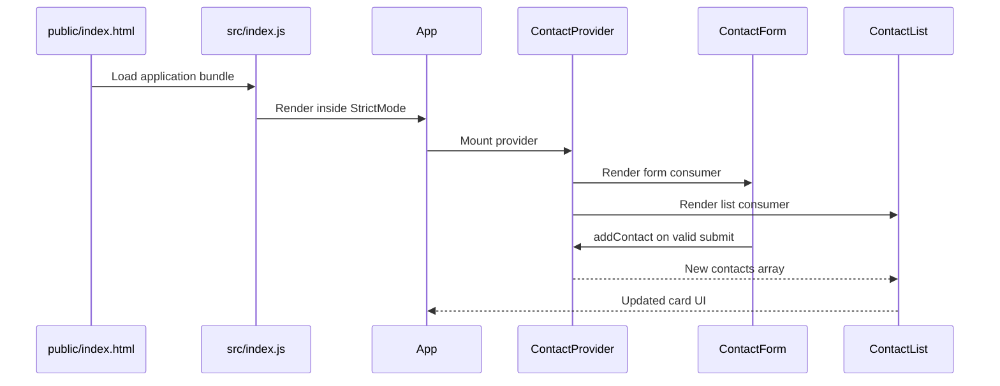

# 🔁 Application lifecycle

```mermaid
sequenceDiagram
  participant HTML as public/index.html
  participant Root as src/index.js
  participant App as App
  participant Provider as ContactProvider
  participant Form as ContactForm
  participant List as ContactList
  HTML->>Root: Load application bundle
  Root->>App: Render inside StrictMode
  App->>Provider: Mount provider
  Provider->>Form: Render form consumer
  Provider->>List: Render list consumer
  Form->>Provider: addContact on valid submit
  Provider-->>List: New contacts array
  List-->>App: Updated card UI
```

The app mounts in React Strict Mode. The provider initializes an empty array for each fresh application mount.
