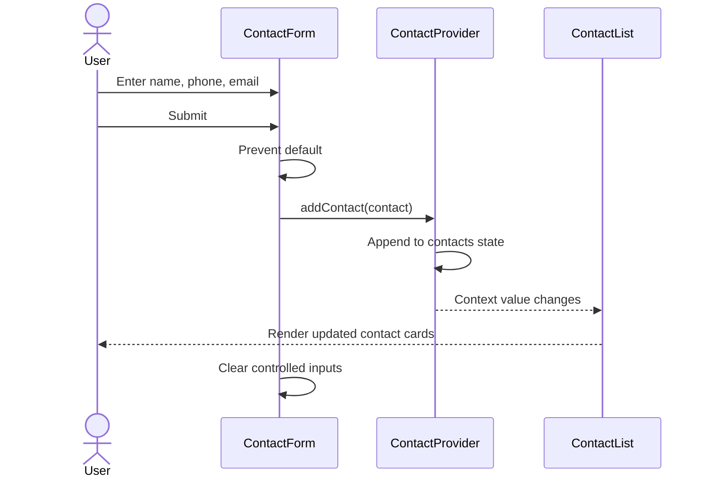

# 🔀 Add-contact sequence diagram

```mermaid
sequenceDiagram
  actor User
  participant Form as ContactForm
  participant Context as ContactProvider
  participant List as ContactList
  User->>Form: Enter name, phone, email
  User->>Form: Submit
  Form->>Form: Prevent default
  Form->>Context: addContact(contact)
  Context->>Context: Append to contacts state
  Context-->>List: Context value changes
  List-->>User: Render updated contact cards
  Form->>Form: Clear controlled inputs
```

No server, database, authentication provider, or network call participates in this sequence.
